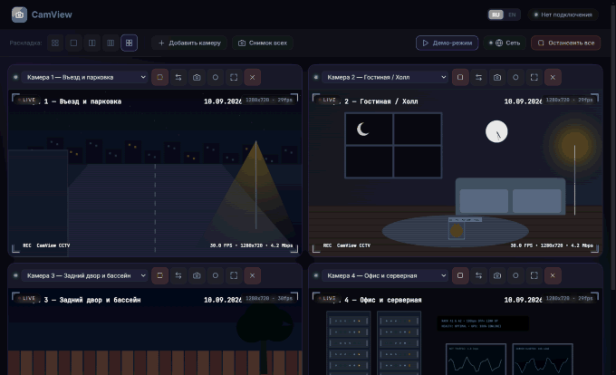
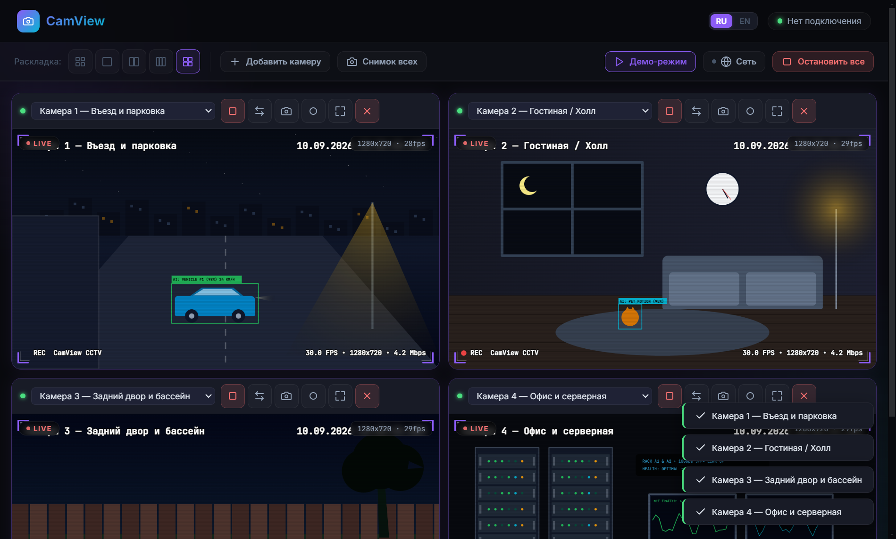
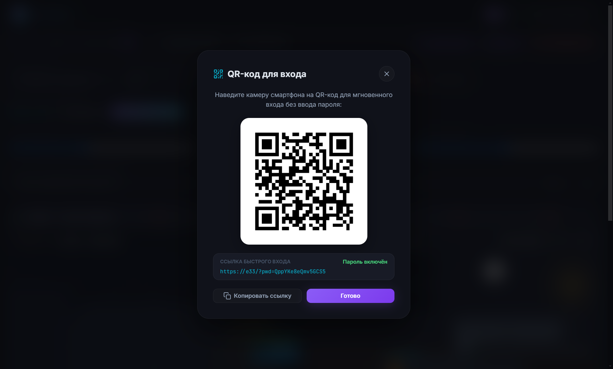

# 📹 CamView — Multi-Camera Surveillance, Video Recording & Remote Access

<p align="center">
  
</p>

<p align="center">
  <b>A modern PC desktop application (Electron) for multi-camera video surveillance, local recording (MP4/WebM), on-screen date/time timestamping, and secure remote streaming to smartphones over local network or the global Internet (Cloudflare, LocalTunnel, Pinggy) via QR code.</b>
</p>

<p align="center">
  <a href="https://github.com/DanikMonster/CamView/releases/latest">
    
  </a>
  
  
  
  <a href="LICENSE">
    
  </a>
</p>

<p align="center">
  🌐 <b>Language / Язык:</b> <b>English</b> • <a href="README_ru.md">Русский</a>
</p>

<p align="center">
  
</p>

<p align="center">
  
  
</p>

<p align="center">
  <a href="#-quick-start-for-users"><b>Download</b></a> •
  <a href="#-key-features"><b>Features</b></a> •
  <a href="#-user-guide"><b>User Guide</b></a> •
  <a href="#-development--build"><b>Build from Source</b></a> •
  <a href="#-project-structure"><b>Project Files</b></a>
</p>

---

## 📥 Quick Start for Users

You don't need to install Node.js or compile any code to use CamView:

1. Navigate to the **[CamView Releases](https://github.com/DanikMonster/CamView/releases/latest)** page.
2. Download the preferred package:
   - 📦 **`CamView Setup 1.0.0.exe`** — Full installer (creates shortcuts, updates seamlessly while preserving settings).
   - 🚀 **`CamView 1.0.0.exe`** — Standalone portable executable (runs without installation, flash drive ready).
3. Launch the application and grant access to your webcams.

---

## ✨ Key Features

### 🎥 Multi-Camera Grid
- View any number of connected cameras simultaneously (laptop webcams, external USB webcams, HDMI capture cards).
- Instant layout presets: **Auto-grid**, **1 Camera**, **2 Cameras**, **3 Cameras**, **4 Cameras**.
- Individual camera controls: Horizontal flip (mirror), fullscreen preview, photo snapshot, recording toggle.

### 🎭 Built-in Virtual Demo Mode
- Instant 1-click test environment with **4 interactive simulated CCTV feeds**:
  - 🚗 **Cam 1 — Driveway & Parking**: Animated traffic with realistic headlight beams and AI vehicle detection tracking.
  - 🛋️ **Cam 2 — Living Room / Hall**: Real-time ticking wall clock, cozy interior lighting, and motion detection.
  - 🏊 **Cam 3 — Backyard & Pool**: Swaying garden trees, animated water ripple reflections, and environmental telemetry.
  - 🖥️ **Cam 4 — Office & Server Room**: Blinking server rack LEDs, real-time network traffic waveform graphs.
- Generates genuine 30 FPS MediaStreams compatible with live MP4 recording, photo snapshots, layout switches, and remote mobile streaming.
- Launch via toolbar button or command line: `npm run demo` or `CamView.exe --demo`.

### ⏱️ Burned-In Timestamp & Label (OSD)
- Hardware-rendered overlay burned directly into every video frame:
  - **Live date and time** with second accuracy.
  - **Camera device name** (e.g., "Logitech HD Pro Webcam").
- Burned directly onto the canvas stream and saved into all exported video recordings and photo snapshots.

### ⏺️ Video Recording
- One-click video stream recording from any active camera.
- Supports **MP4** and **WebM** formats.
- Customizable storage directory for automatic video archiving.
- Quick shortcut button to open the recordings folder directly in Windows File Explorer.

### 🌐 Global Internet Access (Tunnels) & Local Network
- **Cloudflare Tunnel (`trycloudflare.com`)**: Free global access from anywhere in the world over Cloudflare's secure edge network without public IP or port forwarding (includes 1-click automatic `cloudflared` binary download).
- **LocalTunnel (`loca.lt`)**: Built-in global HTTPS tunnel with zero third-party tools required.
- **Pinggy (`*.pinggy.link` / `*.pinggy.net`)**: 1-click automatic HTTPS tunnel via official `@pinggy/pinggy` SDK with zero configuration, plus optional direct 4th-level subdomain selector (`.a.free.pinggy.link`, `.a.pinggy.link`, `.free.pinggy.online`).
- **Custom URL**: Direct input for your own custom domain name, reverse proxy, or external tunnel.
- **Local Network (LAN / Wi-Fi)**: Direct LAN connection with an included 10-year self-signed SSL certificate for all network interfaces.

### 🌐 Bilingual Interface (RU / EN)
- Instant one-click language switcher in the header (**RU / EN**) without reloading.
- Full localization across both the desktop application (`index.html`) and the mobile web client (`remote.html`).
- Automatic persistence of language preferences in `config.json` and browser `localStorage`.

### 🔐 16-Character Cryptographic Password & QR Sign-In
- Strong 16-character access token with instant 1-click regeneration.
- **Desktop QR Generator**: The host generates an instant QR code with an embedded access URL and token.
- **Instant Phone Login**: Scan the QR code with your phone's native camera to open the stream and authorize automatically without manual typing.
- **Offline In-App Scanner**: Mobile web client includes a built-in offline QR scanner powered by `jsQR` (requires no internet connection).

### 🔔 Background System Tray Operation
- Minimizes directly to the Windows System Tray next to the clock when closing or minimizing the window.
- Continuous background recording and streaming without throttling (`backgroundThrottling: false`).
- Clean tray context menu for quick window restore or exit.

### 🎨 Clean Modern UI
- Sharp vector SVG iconography without blurry emojis.
- Sleek dark scrollbars tailored to the dark theme.
- Modern squircle application icon with transparent alpha background.
- Fully responsive mobile web client optimized for low bandwidth and mobile screens.

---

## 📖 User Guide

### 1. Adding and Configuring Cameras
1. Click **"+ Add Camera"** on the top toolbar.
2. Select your device from the dropdown menu on the camera tile.
3. Quick actions:
   - 🔄 **Mirror** — Horizontal flip (ideal for front-facing webcams).
   - 📸 **Snapshot** — Capture photo to the snapshot gallery.
   - ⏺️ **Record** — Start / Stop video recording.
   - ⛶ **Fullscreen** — Expand camera feed to full display (press `Esc` to exit).

### 2. Enabling Remote Surveillance (LAN or Internet)
1. Click **"Network / Remote Access"** on the top toolbar.
2. Choose your preferred **Access Mode**:

| Mode | Coverage | Requirements | URL Structure | SSL / Security |
| :--- | :--- | :--- | :--- | :--- |
| **🌐 Local Network (LAN)** | Home / Office (Wi-Fi) | No internet required | `https://192.168.x.x:8765` | Built-in 10-year certificate |
| **☁️ Cloudflare Tunnel** | Worldwide (Internet) | 1-click `cloudflared` download | `https://*.trycloudflare.com` | Trusted global HTTPS |
| **🚇 LocalTunnel** | Worldwide (Internet) | Zero setup (built-in) | `https://*.loca.lt` | Public HTTPS |
| **⚡ Pinggy Tunnel** | Worldwide (Internet) | Enter 4th-level subdomain | `https://*.a.free.pinggy.link` | Provider HTTPS |
| **🔗 Custom URL** | Worldwide (Internet) | Any custom domain / proxy | `https://your-domain.xyz` | Per custom domain |

3. Click **"Start Server"**.
4. Click **"QR Code Login"**:
   - Point your smartphone's camera at the PC screen or scan the QR code via the mobile web client.
   - Your phone immediately opens the dashboard with the 16-character token pre-filled and starts streaming!

---

## 🛠️ Development & Build

### Prerequisites
- **OS**: Windows 10 or 11 (64-bit)
- **Node.js**: version 20.x or higher ([nodejs.org](https://nodejs.org/))
- **Git** ([git-scm.com](https://git-scm.com/))

### 1. Clone the Repository
```bash
git clone https://github.com/DanikMonster/CamView.git
cd CamView
```

### 2. Install Dependencies
```bash
npm install
```

### 3. Run in Development Mode
```bash
npm start
```

### 4. Build Distribution Packages (Installer & Portable)
```bash
npm run build
```

The compiled binaries will be output to the `dist/` folder:
- `CamView Setup 1.0.0.exe` — Full NSIS installer.
- `CamView 1.0.0.exe` — Standalone portable version.

---

## 📁 Project Structure

```text
CamView/
├── .github/
│   └── workflows/
│       └── build.yml        # CI/CD: Automated Windows builds via GitHub Actions
├── scripts/
│   └── make_icon.ps1        # Script generating multi-resolution icon.ico from PNG
├── .gitignore               # Git ignore rules (node_modules, dist, certs, config)
├── LICENSE                  # MIT License
├── README.md                # English documentation
├── README_ru.md             # Russian documentation (Русскоязычная документация)
├── package.json             # App metadata, scripts & electron-builder configuration
├── package-lock.json        # NPM dependency lockfile
├── main.js                  # Electron main process (HTTPS, WS, IPC, tray, QR, tunnels)
├── preload.js               # Secure contextBridge IPC bridge
├── index.html               # Desktop Electron UI application
├── remote.html              # Mobile-optimized client for remote monitoring
├── jsqr.js                  # Standalone offline QR code scanner library
├── icon.ico                 # Multi-resolution Windows app icon (256..16 px)
└── icon.png                 # App logo & web favicon
```

---

## ⚖️ Privacy Policy & Legal Notice

- This software is intended for personal surveillance and monitoring (e.g., pet monitoring, home security, workstation checks).
- Video streams are transmitted **directly (peer-to-peer / local network)** in encrypted form between the host computer and the connected viewer. No third-party servers or developer storage are involved.
- Users are responsible for complying with applicable privacy and surveillance laws: non-consensual surveillance is strictly prohibited.

---

## 📄 License

This project is licensed under the [MIT License](LICENSE).
