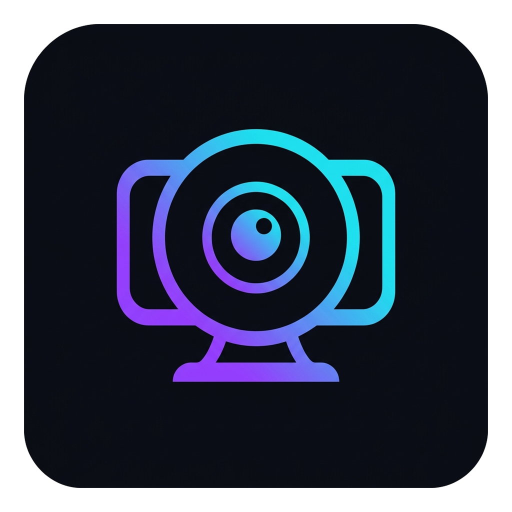

# 📹 CamView — Мультикамерное наблюдение, запись видео и удалённый доступ

<p align="center">
  
</p>

<p align="center">
  <b>Современное приложение для ПК (Electron) для мультикамерного наблюдения, локальной записи видео (MP4/WebM), наложения штампа времени и защищённого удалённого доступа со смартфонов через локальную сеть или глобальный интернет (Cloudflare, LocalTunnel, Pinggy) по QR-коду.</b>
</p>

<p align="center">
  <a href="https://github.com/DanikMonster/CamView/releases/latest">
    
  </a>
  
  
  
  <a href="LICENSE">
    
  </a>
</p>

<p align="center">
  <a href="#-быстрый-старт-для-пользователей"><b>Скачать</b></a> •
  <a href="#-основные-возможности"><b>Возможности</b></a> •
  <a href="#-инструкция-по-использованию"><b>Инструкция</b></a> •
  <a href="#-разработка-и-сборка"><b>Сборка из исходников</b></a> •
  <a href="#-структура-проекта"><b>Файлы проекта</b></a>
</p>

---

## 📥 Быстрый старт для пользователей

Вам не нужно устанавливать Node.js или компилировать код, чтобы пользоваться CamView:

1. Перейдите на страницу **[Релизов CamView (Releases)](https://github.com/DanikMonster/CamView/releases/latest)**.
2. Скачайте подходящий файл:
   - 📦 **`CamView Setup 1.0.0.exe`** — полноценный установщик (создает ярлыки, автоматически обновляет программу без сброса настроек).
   - 🚀 **`CamView 1.0.0.exe`** — портативная версия (работает без установки, можно запускать с флешки).
3. Запустите программу и разрешите доступ к веб-камерам.

---

## ✨ Основные возможности

### 🎥 Мультикамерная сетка
- Одновременный вывод любого количества подключённых камер (встроенные веб-камеры ноутбуков, внешние USB-камеры, карты захвата).
- Готовые пресеты сетки: **Автосетка**, **1 камера**, **2 камеры**, **3 камеры**, **4 камеры**.
- Индивидуальные настройки для каждой камеры: зеркальное отображение (Flip), полноэкранный режим, снимок кадра, управление записью.

### ⏱️ Впечатанный штамп времени (OSD)
- На каждый кадр в реальном времени накладываются:
  - **Дата и время** с точностью до секунд.
  - **Название камеры** (например, «Веб-камера Logitech HD»).
- Титры рисуются аппаратно на холсте и сохраняются в итоговые видеозаписи и скриншоты.

### ⏺️ Запись видео
- Запись видеопотока с любой активной камеры в один клик.
- Поддержка форматов **MP4** и **WebM**.
- Возможность выбора произвольной папки на диске для автоматического сохранения видеоархива.
- Кнопка быстрого открытия папки с записями в Проводнике Windows прямо из приложения.

### 🌐 Доступ из глобального интернета (Туннели) и локальная сеть
- **Cloudflare Tunnel (`trycloudflare.com`)**: бесплатный глобальный доступ из любой точки мира через защищённую сеть Cloudflare без белого IP и без проброса портов (с поддержкой загрузки `cloudflared` в 1 клик).
- **LocalTunnel (`loca.lt`)**: встроенный глобальный HTTPS-доступ без необходимости скачивать какие-либо сторонние утилиты.
- **Pinggy (*.pinggy.link)**: прямой удобный ввод поддомена 4-го уровня (`[поддомен]` + селектор `.a.free.pinggy.link` / `.a.pinggy.link` / `.free.pinggy.online`) с умным авто-распознаванием при вставке полного URL.
- **Свой URL / Custom URL**: возможность указать произвольный публичный домен или внешний туннель.
- **Локальная сеть (LAN/Wi-Fi)**: прямое подключение внутри домашней/офисной сети с бессрочным 10-летним SSL-сертификатом для всех сетевых интерфейсов.

### 🌐 Двуязычный интерфейс (RU / EN)
- Мгновенное переключение языка приложения в шапке (RU / EN) в один клик без перезагрузки.
- Полная локализация как настольного приложения (`index.html`), так и мобильного веб-клиента (`remote.html`).
- Автоматическое сохранение выбранного языка в конфигурации и `localStorage`.

### 🔐 16-значный криптографический пароль и вход по QR
- Надежный 16-значный пароль доступа с генерацией в один клик.
- **Генерация QR на ПК**: сервер формирует QR-код с прямой ссылкой и паролем.
- **Автовход со смартфона**: при наведении стандартной камеры телефона на QR-код мобильный браузер сразу открывает трансляцию и авторизуется без ручного ввода.
- **Встроенный автономный сканер**: веб-клиент снабжен встроенным сканером на базе оффлайн-библиотеки `jsQR` (не требует подключения к интернету).

### 🔔 Фоновая работа в системном трее (System Tray)
- При нажатии на крестик окно сворачивается в системный трей возле часов Windows.
- Приложение продолжает вести запись и транслировать видео без троттлинга (`backgroundThrottling: false`).
- Удобное контекстное меню в трее для быстрого открытия или выхода.

### 🎨 Современный интерфейс и аккуратный дизайн
- Четкие векторные SVG-иконки без размытия и эмодзи.
- Тонкие темные скроллбары, гармонично вписанные в ночную тему интерфейса.
- Иконка приложения со скруглёнными углами (форма squircle) и прозрачным фоном.
- Полная адаптивность веб-интерфейса под экраны смартфонов с экономией трафика.

---

## 📖 Инструкция по использованию

### 1. Добавление и настройка камер
1. Нажмите кнопку **«+ Добавить камеру»** на верхней панели.
2. В выпадающем списке на плитке выберите нужное устройство.
3. Доступные быстрые действия:
   - 🔄 **Зеркало** — горизонтальный разворот видео (удобно для фронтальных камер).
   - 📸 **Снимок** — сохранение фото в нижнюю галерею снимков.
   - ⏺️ **Запись** — старт/остановка видеозаписи.
   - ⛶ **Полный экран** — разворот видео на весь экран (выход по клавише `Esc`).

### 2. Включение удаленного просмотра (в локальной сети или через интернет)
1. Нажмите на верхней панели кнопку **«Сеть / Удаленный доступ»**.
2. В поле **«Режим доступа»** выберите подходящий вариант:

| Режим | Зона действия | Требования | Формат адреса | SSL / Защита |
| :--- | :--- | :--- | :--- | :--- |
| **🌐 Локальная сеть (LAN)** | Дом / Офис (Wi-Fi) | Без интернета | `https://192.168.x.x:8765` | Встроенный 10-летний сертификат |
| **☁️ Cloudflare Tunnel** | Весь мир (Интернет) | Загрузка `cloudflared` в 1 клик | `https://*.trycloudflare.com` | Доверенный глобальный HTTPS |
| **🚇 LocalTunnel** | Весь мир (Интернет) | Без установки (уже встроено) | `https://*.loca.lt` | Публичный HTTPS |
| **⚡ Pinggy Tunnel** | Весь мир (Интернет) | Ввод 4-го поддомена Pinggy | `https://*.a.free.pinggy.link` | HTTPS провайдера |
| **🔗 Свой URL / Custom** | Весь мир (Интернет) | Любой произвольный домен | `https://your-domain.xyz` | По протоколу домена |

3. Нажмите **«Запустить»**.
4. Нажмите **«QR-код для входа»**:
   - Наведите камеру смартфона на экран ПК или отсканируйте код встроенным сканером в веб-интерфейсе.
   - Смартфон мгновенно откроет страницу с предзаполненным 16-значным токеном и сразу начнёт приём видеопотока без ввода логинов и паролей!

---

## 🛠️ Разработка и сборка

### Системные требования
- **ОС**: Windows 10 или 11 (64-bit)
- **Node.js**: версии 20.x или выше ([nodejs.org](https://nodejs.org/))
- **Git** ([git-scm.com](https://git-scm.com/))

### 1. Клонирование репозитория
```bash
git clone https://github.com/DanikMonster/CamView.git
cd CamView
```

### 2. Установка зависимостей
```bash
npm install
```

### 3. Запуск приложения в режиме разработки
```bash
npm start
```

### 4. Сборка дистрибутивов (Installer и Portable)
```bash
npm run build
```

Готовые бинарные файлы появятся в каталоге `dist/`:
- `CamView Setup 1.0.0.exe` — установщик NSIS.
- `CamView 1.0.0.exe` — портативная версия.

---

## 📁 Структура репозитория

```text
CamView/
├── .github/
│   └── workflows/
│       └── build.yml        # CI/CD: автосборка Windows EXE в GitHub Actions
├── scripts/
│   └── make_icon.ps1        # Скрипт нарезки multi-resolution icon.ico из PNG
├── .gitignore               # Исключения Git (node_modules, dist, ключи, конфиги)
├── LICENSE                  # Лицензия MIT
├── README.md                # Документация проекта
├── package.json             # Зависимости и конфигурация electron-builder
├── package-lock.json        # Лок-файл версий пакетов npm
├── main.js                  # Главный процесс Electron (сервер, трей, IPC, SSL, QR)
├── preload.js               # Безопасный мост contextBridge между Electron и UI
├── index.html               # Главный интерфейс приложения для ПК
├── remote.html              # Мобильный веб-интерфейс для удалённого просмотра
├── jsqr.js                  # Автономная оффлайн-библиотека сканера QR-кодов
├── icon.ico                 # Мульти-разрешение иконки Windows (256..16 px)
└── icon.png                 # PNG-логотип и фавикон веб-интерфейса
```

---

## ⚖️ Политика конфиденциальности и правовая информация

- Приложение создано для персонального использования (присмотр за домашними животными, мониторинг дома или рабочего места).
- Видеопоток передается **напрямую (P2P / Local LAN)** в зашифрованном виде между компьютером и подключенным устройством. Сторонние облачные хранилища или сервера разработчиков не используются.
- Пользователь обязуется соблюдать законодательство о защите частной жизни: негласное видеонаблюдение без согласия людей запрещено.

---

## 📄 Лицензия

Проект распространяется под свободной лицензией [MIT](LICENSE).
